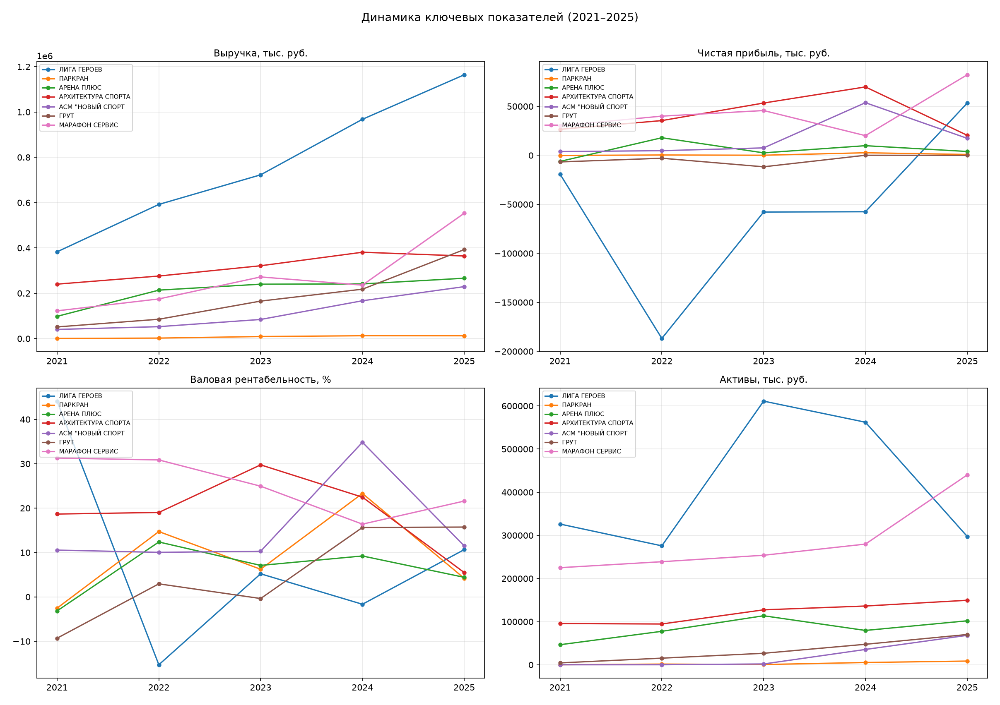
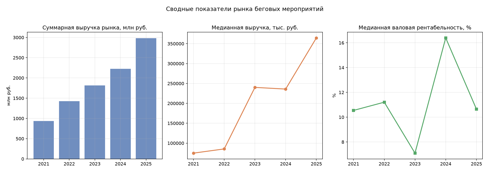
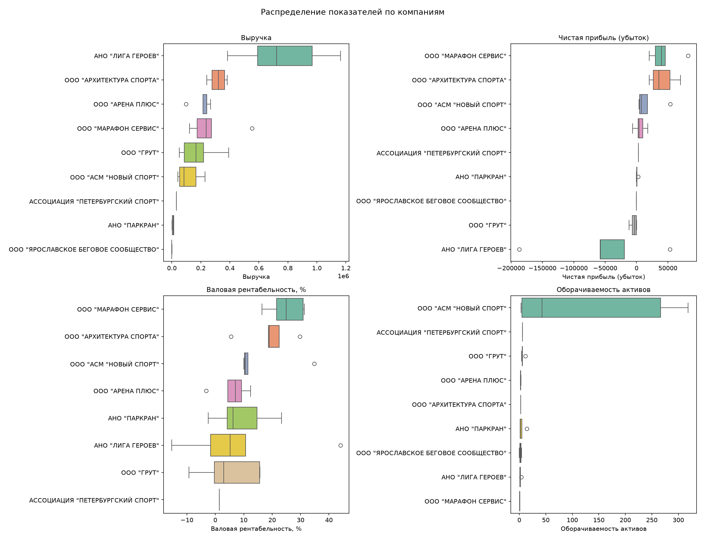
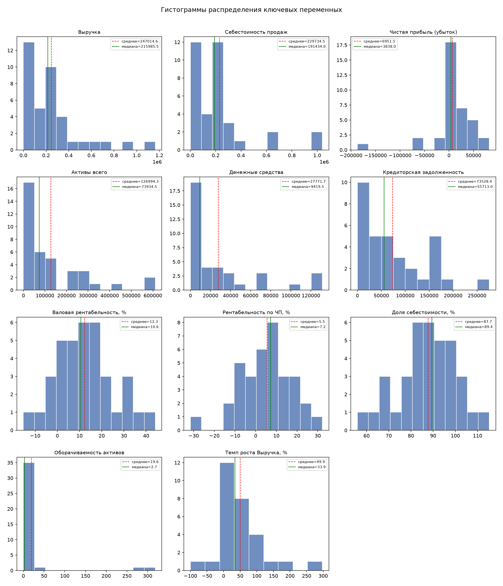
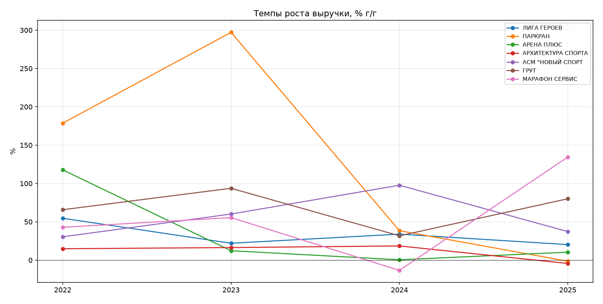

# Этап 4. Однофакторный (дескриптивный) анализ

## 4.1. Состав выборки

- **49 наблюдений** (компания × год), **11 компаний**, период 2021–2025
- ОПФ: 30 наблюдений ООО, 19 наблюдений НКО
- Наблюдений с данными по выручке: **38 из 49** (9 компаний)
- 7 компаний имеют полные данные по выручке за 5 периодов

## 4.2. Описательные статистики

| Переменная | N | Среднее | Медиана | σ | Min | Max | Асимметрия | Типичное среднее |
|---|---|---|---|---|---|---|---|---|
| Выручка, тыс. руб. | 38 | 247 015 | 215 986 | 263 213 | 0 | 1 164 006 | 1.85 | медиана |
| Себестоимость, тыс. руб. | 36 | 229 735 | 191 434 | 251 749 | 850 | 1 040 047 | 2.01 | медиана |
| Чистая прибыль, тыс. руб. | 37 | 6 952 | 3 838 | 43 722 | −186 806 | 82 203 | −2.36 | медиана |
| Активы, тыс. руб. | 38 | 126 994 | 73 935 | 157 631 | 10 | 611 139 | 1.62 | медиана |
| Валовая рентабельность, % | 36 | 12.3 | 10.6 | 12.8 | −15.3 | 44.1 | 0.31 | среднее |
| Рентабельность по ЧП, % | 37 | 5.5 | 7.2 | 12.1 | −31.6 | 32.2 | −0.47 | среднее |
| Доля себестоимости, % | 36 | 87.7 | 89.4 | 12.8 | 55.9 | 115.3 | −0.31 | среднее |
| Оборачиваемость активов | 38 | 19.6 | 2.7 | 65.8 | 0.0 | 318.4 | 4.16 | медиана |
| Темп роста выручки, % | 29 | 49.9 | 33.9 | 70.4 | −100.0 | 297.1 | 1.55 | медиана |

### Ключевые наблюдения

- **Сильная правая асимметрия** у абсолютных показателей (выручка, активы, денежные средства) — распределения скошены вправо из-за доминирования Лиги героев (выручка 1.16 млрд в 2025).
- **Рентабельность распределена симметрично** (асимметрия 0.31) — среднее и медиана близки, можно использовать параметрические методы.
- **Медианная чистая прибыль** — 3 838 тыс. руб. (положительная), но среднее искажено крупным убытком Лиги героев в 2022 (−187 млн).
- **Медианный темп роста выручки** — 33.9%, что указывает на быстрорастущий рынок.
- **Оборачиваемость активов** — экстремальный разброс (медиана 2.7, максимум 318) объясняется микрокомпаниями с минимальными активами.

## 4.3. Проверка нормальности (Шапиро-Уилк)

| Переменная | W | p-value | Нормальное? |
|---|---|---|---|
| Выручка | 0.809 | <0.001 | Нет |
| Себестоимость | 0.756 | <0.001 | Нет |
| Чистая прибыль | 0.772 | <0.001 | Нет |
| Активы | 0.788 | <0.001 | Нет |
| Денежные средства | 0.740 | <0.001 | Нет |
| Кредиторская задолженность | 0.890 | 0.003 | Нет |
| **Валовая рентабельность, %** | **0.989** | **0.966** | **Да** |
| **Рентабельность по ЧП, %** | **0.977** | **0.629** | **Да** |
| **Доля себестоимости, %** | **0.989** | **0.966** | **Да** |
| Оборачиваемость активов | 0.295 | <0.001 | Нет |
| Темп роста выручки, % | 0.856 | 0.001 | Нет |

### Вывод

- **3 из 11 переменных** имеют нормальное распределение — все три связаны с рентабельностью (относительные показатели).
- Абсолютные финансовые показатели (выручка, активы, прибыль) — **ненормальные**.
- **Следствие для анализа:**
  - Для корреляций между абсолютными показателями → **Спирмен**
  - Для проверки H1 (средний темп роста) → **Вилкоксон** (ненормальное распределение темпов роста)
  - Для корреляций с рентабельностью → допустим **Пирсон**, но Спирмен надёжнее при малой выборке

## 4.4. Визуализация

### Динамика ключевых показателей (2021–2025)

- Все компании демонстрируют рост выручки (кроме единичного снижения Марафон Сервис в 2024).
- Лига героев — абсолютный лидер по выручке (1.16 млрд в 2025), но с убытками в 2022–2024.
- Валовая рентабельность конвергирует к диапазону 5–15% у большинства компаний к 2025.

### Сводные показатели рынка

- Суммарная выручка рынка выросла с 936 млн (2021) до 2 988 млн руб. (2025) — **рост в 3.2 раза за 4 года**.
- Медианная выручка выросла с 51.5 тыс. (2021) до 364.5 тыс. руб. (2025).
- Медианная рентабельность колеблется в диапазоне 7–16% без выраженного тренда.

### Распределение показателей по компаниям

- Марафон Сервис — лидер по стабильности рентабельности (медиана ~25%).
- Лига героев — наибольший разброс рентабельности (от −15% до +44%).
- ГРУТ и Лига героев — наиболее волатильные по чистой прибыли.

### Гистограммы распределений

### Темпы роста выручки

- Темпы роста положительны практически у всех компаний во все периоды.
- Наибольшая волатильность темпов роста — у Марафон Сервис (от −13% до +134%).

## Выходные файлы

| Файл | Описание |
|---|---|
| `output/descriptive_stats.xlsx` | Описательные статистики: среднее, медиана, σ, Q1/Q3, асимметрия, эксцесс |
| `output/normality_tests.xlsx` | Результаты теста Шапиро-Уилка |
| `output/plots/histograms.png` | Гистограммы ключевых переменных |
| `output/plots/boxplots.png` | Boxplot по компаниям |
| `output/plots/dynamics.png` | Динамика 4 показателей за 2021–2025 |
| `output/plots/revenue_growth.png` | Темпы роста выручки |
| `output/plots/market_summary.png` | Сводные показатели рынка |
