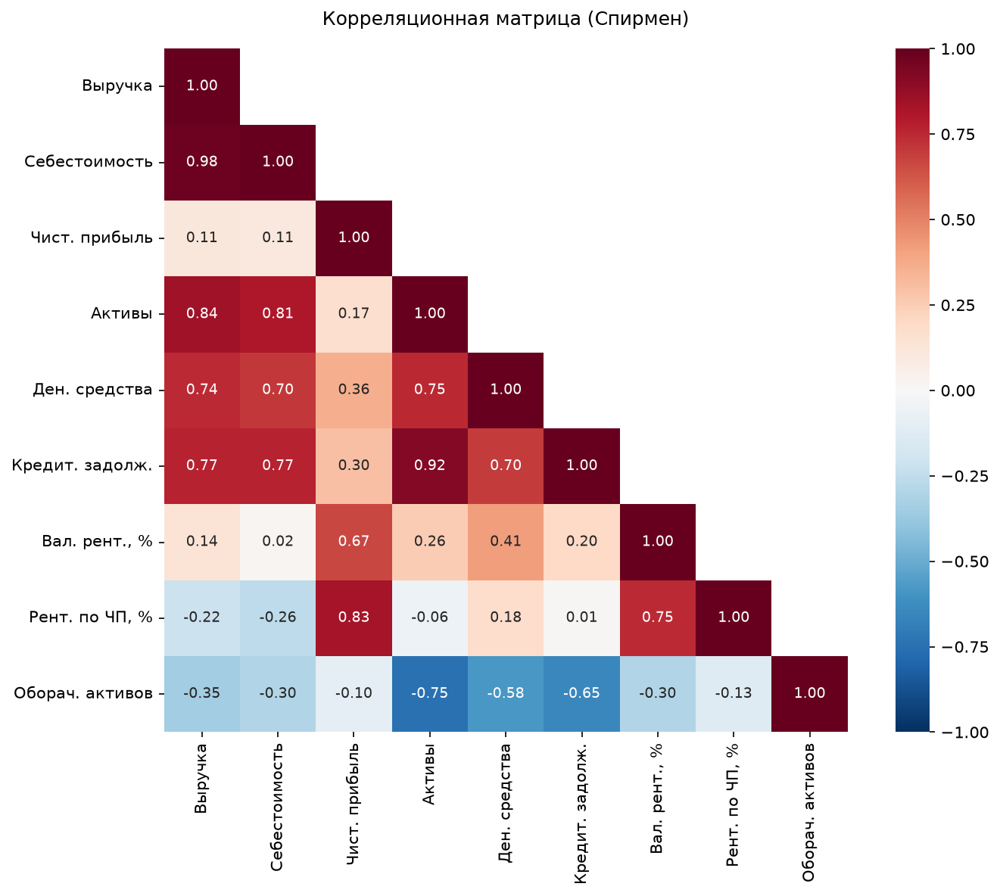
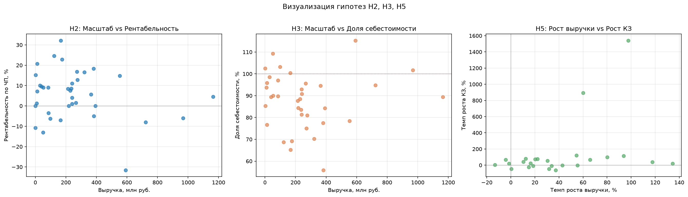

# Этап 5. Инференциальный (заключающий) анализ

## 5.1. Проверка гипотез

### H1: Рынок демонстрирует устойчивый рост — ПОДТВЕРЖДЕНА

| Параметр | Значение |
|---|---|
| N | 29 |
| Медиана темпа роста | +33.9% |
| Положительных наблюдений | 25 из 29 (86%) |
| Тест | Вилкоксон (односторонний, H₁: медиана > 0) |
| W = 399.0 | **p < 0.0001** |

Медианный темп роста положителен во все годы:

| Год | Медиана, % | N |
|---|---|---|
| 2022 | +48.7 | 8 |
| 2023 | +55.5 | 7 |
| 2024 | +31.8 | 7 |
| 2025 | +20.3 | 7 |

**Вывод:** рынок беговых мероприятий демонстрирует статистически значимый устойчивый рост. Темпы роста замедляются (с ~50% до ~20%), что указывает на переход от фазы взрывного постковидного восстановления к более зрелому росту.

### H2: Зависимость масштаба и рентабельности — НЕ ПОДТВЕРЖДЕНА

| Параметр | Значение |
|---|---|
| N | 37 |
| Корреляция Спирмена | ρ = −0.080 |
| p-value | 0.638 |

**Вывод:** связь между выручкой и рентабельностью по чистой прибыли статистически незначима. Крупные организаторы не обязательно более рентабельны — Лига героев (крупнейшая по выручке) работала в убыток в 2021–2024, тогда как меньший Марафон Сервис стабильно прибылен.

### H3: Эффект масштаба в себестоимости — НЕ ПОДТВЕРЖДЕНА

| Параметр | Значение |
|---|---|
| N | 36 |
| Корреляция Спирмена | ρ = −0.195 |
| p-value | 0.254 |

**Вывод:** направление связи ожидаемое (отрицательное — при росте выручки доля себестоимости снижается), но корреляция слабая и незначимая. Эффект масштаба на данной выборке не подтверждается. Возможное объяснение: затраты на организацию мероприятий (логистика, аренда, персонал) растут примерно пропорционально масштабу.

### H5: Рост выручки сопровождается ростом КЗ — НЕ ПОДТВЕРЖДЕНА

| Параметр | Значение |
|---|---|
| N | 25 |
| Корреляция Спирмена | ρ = +0.324 |
| p-value | 0.114 |

**Вывод:** положительная корреляция (ρ = 0.32) указывает на тенденцию, но она незначима при α = 0.05. При расширении выборки эта связь может стать значимой — направление экономически логично.

### Дополнительный тест: ОПФ vs прибыльность

| | Прибыльные | Убыточные |
|---|---|---|
| НКО | 6 | 5 |
| ООО | 21 | 5 |

χ² = 1.53, p = 0.216 — связь незначима. ОПФ не определяет прибыльность.

## 5.2. Корреляционная матрица (Спирмен)

### Сильные значимые корреляции (|ρ| > 0.7, p < 0.05)

| Пара переменных | ρ | Интерпретация |
|---|---|---|
| Выручка ↔ Себестоимость | +0.98 | Тривиальная: затраты растут с выручкой |
| Активы ↔ Кредиторская задолженность | +0.92 | Рост бизнеса финансируется за счёт КЗ |
| Выручка ↔ Активы | +0.84 | Масштаб деятельности связан с размером активов |
| Чистая прибыль ↔ Рентабельность по ЧП | +0.83 | Тривиальная: прибыль определяет рентабельность |
| Выручка ↔ Кредиторская задолженность | +0.77 | Крупные компании имеют больше КЗ |
| Выручка ↔ Денежные средства | +0.74 | Крупные компании держат больше ликвидности |
| Валовая рентабельность ↔ Рентабельность по ЧП | +0.75 | Валовая маржа — ключевой драйвер итоговой прибыльности |
| Активы ↔ Оборачиваемость | −0.75 | Крупные компании менее «оборотисты» (капиталоёмкость) |

### Нетривиальные находки

- **Выручка не коррелирует с чистой прибылью** (ρ = 0.11) — масштаб не гарантирует прибыльность.
- **Денежные средства положительно коррелируют с валовой рентабельностью** (ρ = 0.41) — более рентабельные компании накапливают кэш.
- **Оборачиваемость активов отрицательно коррелирует с рентабельностью** (ρ = −0.30) — компании с высокой оборачиваемостью (лёгкие по активам) имеют меньшую маржу.

## 5.3. Визуализация гипотез

Scatter-графики подтверждают статистические выводы: чёткой линейной зависимости не наблюдается ни для H2, ни для H3, ни для H5.

## Сводка

| Гипотеза | Тест | Результат | p-value |
|---|---|---|---|
| **H1**: Устойчивый рост рынка | Вилкоксон | **Подтверждена** | <0.0001 |
| **H2**: Масштаб → рентабельность | Спирмен | Не подтверждена | 0.638 |
| **H3**: Эффект масштаба | Спирмен | Не подтверждена | 0.254 |
| **H4**: Кластеры | — | *Этап 6* | — |
| **H5**: Рост выручки → рост КЗ | Спирмен | Не подтверждена | 0.114 |

## Выходные файлы

| Файл | Описание |
|---|---|
| `output/hypothesis_tests.xlsx` | Сводка тестов гипотез |
| `output/correlation_matrix.xlsx` | Корреляционная матрица + p-values |
| `output/plots/correlation_heatmap.png` | Тепловая карта корреляций |
| `output/plots/hypothesis_scatters.png` | Scatter-графики H2, H3, H5 |
